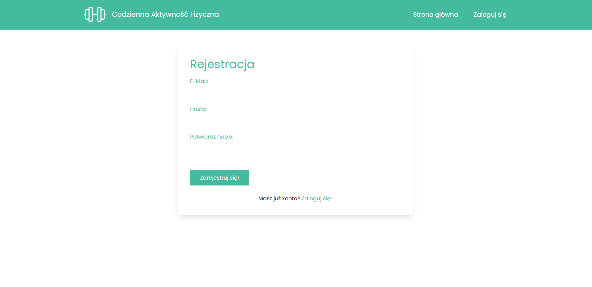
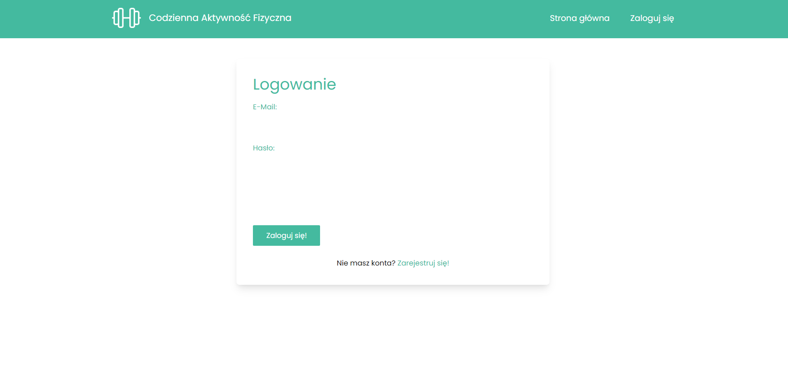
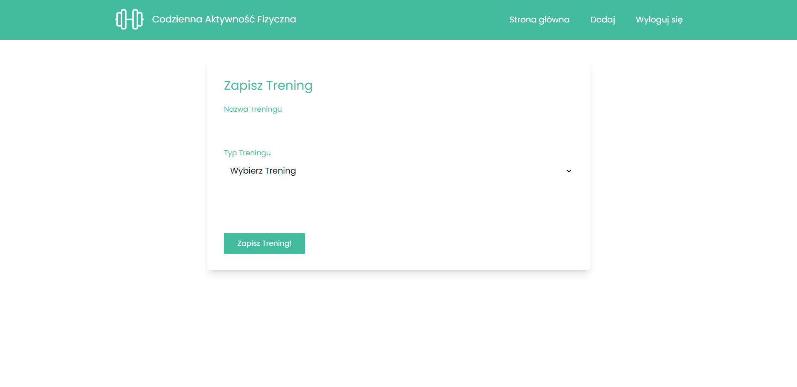
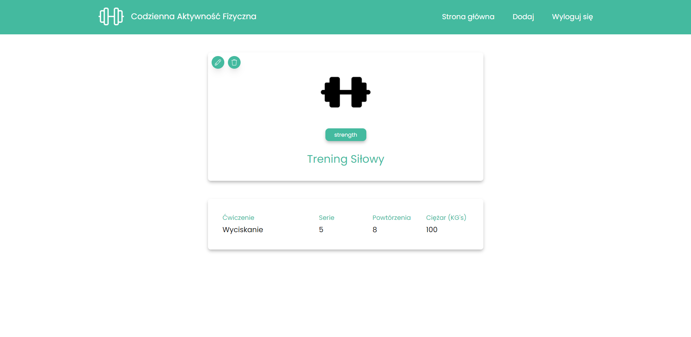
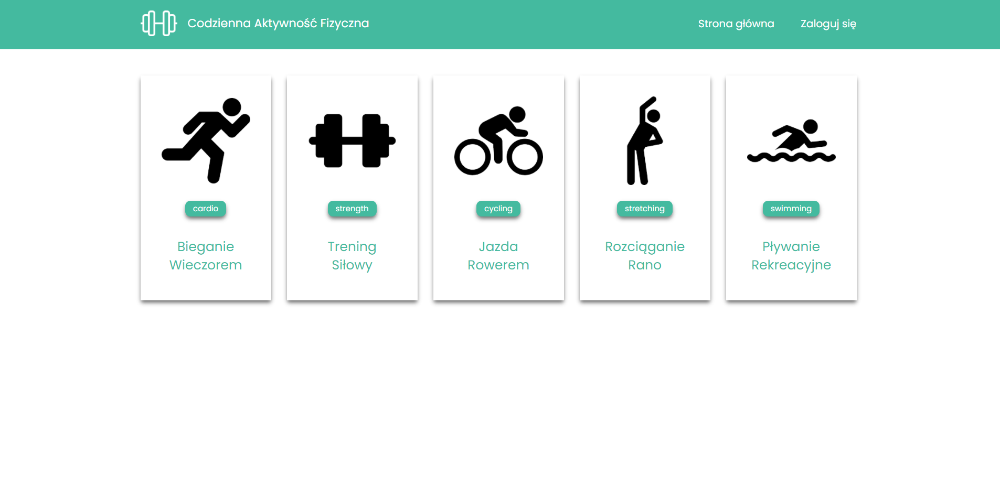
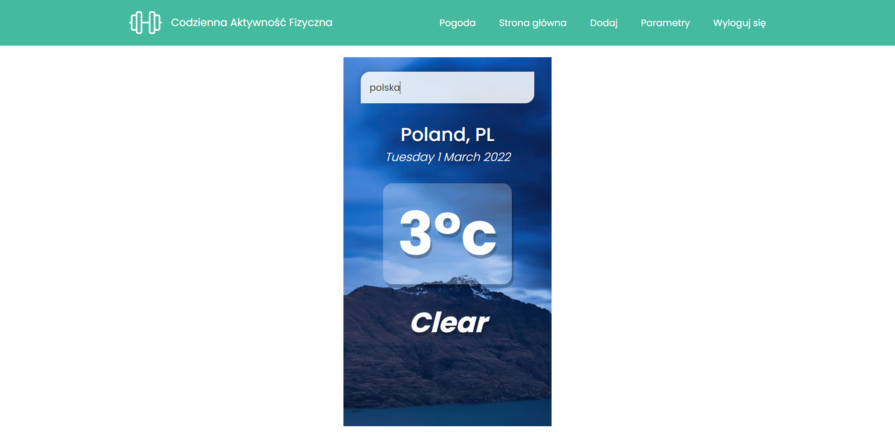
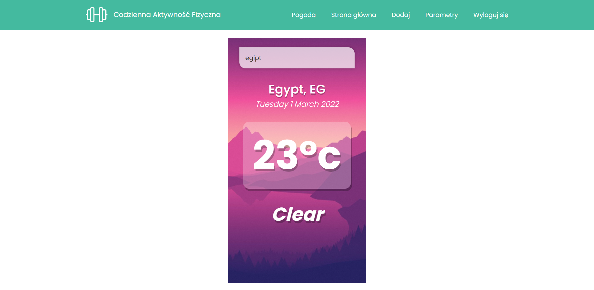

# daily_activity

A project of a daily activity. Technologies: Vue.js, Vuex, JavaScript, Supabase, Tailwind CSS, CSS and HTML.

Some screenshots from the project:

1. Registration:


2. Login:


3. Create Workout:


4. View Workout:


5. Home:


6. Weather:



## Project setup
```
npm install
```

### Compiles and hot-reloads for development
```
npm run serve
```

### Compiles and minifies for production
```
npm run build
```

### Lints and fixes files
```
npm run lint
```

### Customize configuration
See [Configuration Reference](https://cli.vuejs.org/config/).
